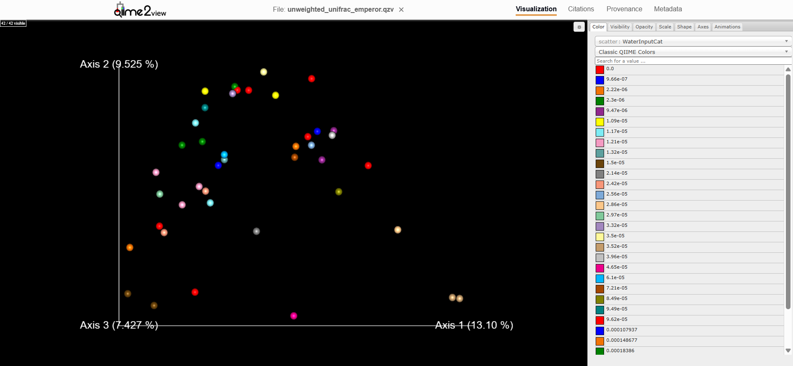
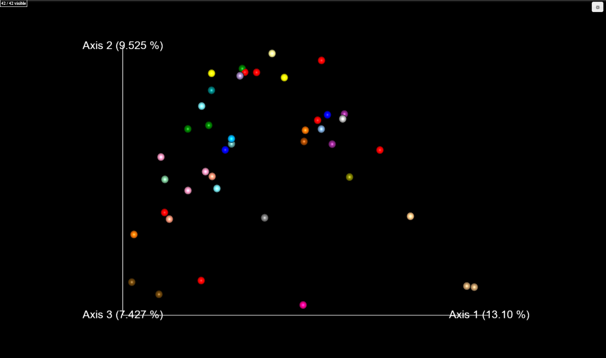
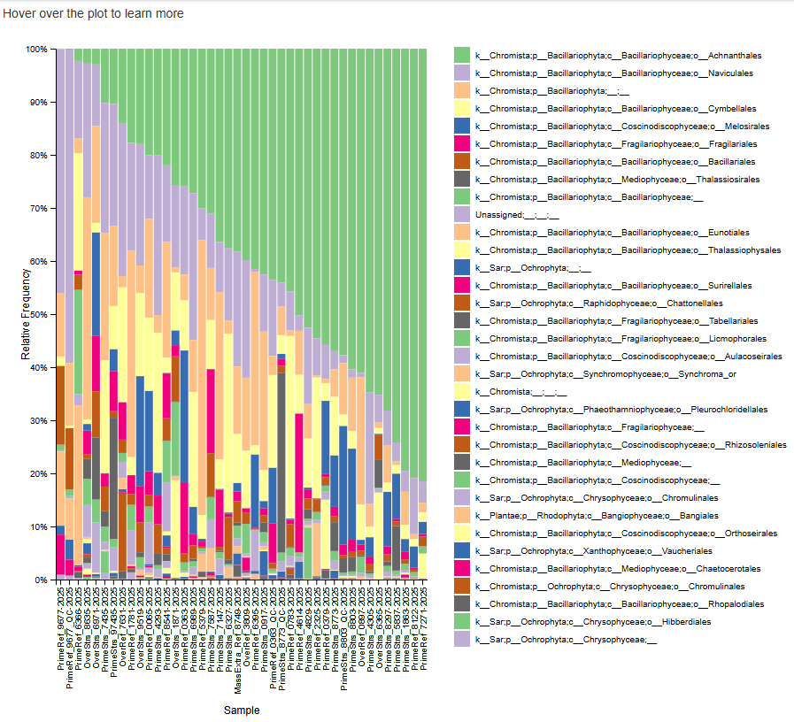
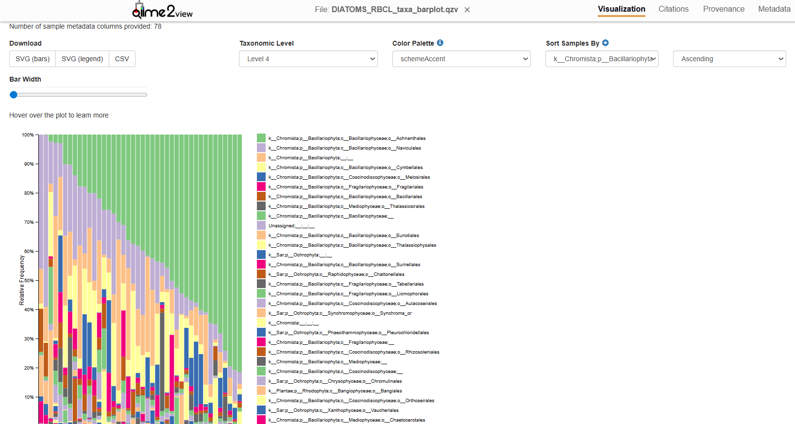

# Metabarcoding Analysis of Algae Diatoms

## Authors
Luke Insana & Ari Kamvar

## Background

DNA metabarcoding is important since it’s used to quickly characterize different DNA samples (EMBL-EBI, n.d.). This becomes important when analyzing diatoms, where one main reason for analyzing diatoms is that they play a role as major producers in the global ecosystem (Vidaković et al., 2024). The data that was provided to us was from the Massachusetts Department of Environmental Protection (MassDEP), whose goal is to perform metabarcoding on the diatom species, and compare them from both high and low quality streams. Using their data, we analyzed significant varying characteristics, as well as phylogenetic relationships amongst the different taxa of diatoms species.

## Methods

From the given fastqgz files data below, we were able to run a program that would undergo trimming, alignment, and classification before being put onto a taxa bar and unweighted unifrac emperor (PCA) plots. We used the QIIME and genomics conda environments to run QIIME and fastp commands, respectively. QIIME parameters were given to us prior to running any QIIME based commands (refer to APPX_qiime2_parameters.sh). To begin the process, all the directories were tasked with organizing the raw, filtered, and analyzed data in the form of .qza and .qzv files were initially created (refer to 00_directories.sh). A .qza file more specifically is a QIIME zipped artifact, and a .qzv file is essentially a QIIME zipped visualization file. After making all the directories, the conda environment for fastp was activated, and the polyGfilter (the filtering stage) parameters were set up (refer to 01A_trim.sh). Once the conda environment was present, the fastp program ran successfully (refer to 01B_polyGfilter.sh); this program removed the polyG tails, filtered out reads that were too short for further analysis, and counted the number of reads both before and after the filtering process. Following the removal of empty files, the data was imported into the QIIME 2 environment. The Cutadapt plugin was then used to set primers and perform a comprehensive "clean up" by removing adapter sequences, unwanted sequences, poly-A tails, and primers. This process isolated the specific amplicons of interest and summarized the data into a standardized format for downstream QIIME 2 processing (refer to 02_cutadapt.sh). Essentially, this step was to isolate only the amplicons that we want to analyze into the file we are creating for data analysis. Following sequence cleanup, the DADA2 denoising platform was utilized to correct sequencing errors, dereplicate identical sequences, and remove chimeric sequences (refer to 03_denoise.sh). Subsequently, taxonomic classification of the diatom data was performed using the QIIME 2 feature-classifier plugin, which assigned biological identities to the sequences based on a provided reference database and metadata (refer to 04_classify.sh). Finally, taxonomic visualizations were generated following a necessary reformatting of the feature table. To address formatting the inconsistencies and account for duplicate samples, a new column was appended to the table using a dedicated reformatting metadata file. This updated table was then processed through a two-step filtering chain that refined the data by both feature and sample. In this pipeline, the output from the initial filtering step served as the input for the subsequent one, utilizing a secondary metadata file specifically designed for downstream analysis rather than reformatting. After all the tabular and plotting reformatting, a taxa bar plot was generated, and alpha (α) and beta (ß) diversity metrics were calculated. The metrics were then analyzed to create the following plots: a Bray-Curtis Emperor plot, a Jaccard Emperor plot, and Weighted and Unweighted Unifrac Emperor plots (also known as weight and unweighted PCA plots). All these plots (including the Taxa Bar plot) were lastly moved into a separate directory for easy and convenient access. Refer to 05_plots.sh for any information related to any of the table reformatting and plotting. For the scope of this project’s analysis, the unweighted emperor unifrac (PCoA) plot and the taxanomic bar plot are being analyzed below.

## Findings

### Data Analysis: Unweighted UniFrac PCoA

Figure 1: PCoA with species legend. The greatest source of variability is Axis 1 (the x-axis). The second greatest source of variability is Axis 2 (the y-axis). The third greatest source of varaibility is Axis 3 (not visible, the z-axis).

&nbsp;

Figure 2: PCoA plot without the legend. Same axes as Figure 1.

&nbsp;

The PCoA, or Principal Coordinates Analysis, visualization from the unweighted_unifrac_emperor.qzv plot visually demonstrates several distinct characteristics regarding the microbial community structure of our diatom samples. These distinct characteristics include Significant Phylogenetic Separation (Axis 1), Unique Phylogenetic Signatures, High Intra-Group relatedness as well as Environmental Exclusivity, and these parameters were analyzed specifically using the QIIME 2 View platform online.  Within Figures 1 and 2 above is the unweighted unifrac emperor plot. From this plot, a notable pattern discerned was the distinct cluster of light-tan spheres isolated on the far-right side of Axis 1 (the x-axis). Since Axis 1 captures the most significant variation in the data mostly due to water input categories, this separation suggests that these specific samples possess a unique phylogenetic signature, containing microbial lineages that are largely absent from the rest of the group, but are all more closely related to one another. This qualitative measure of phylogenetic distance, known as Unweighted UniFrac, primarily indicates that these specific water inputs may have created an environment so distinct and unique from the typical, that the core microbiome found in other samples could not survive or thrive in those specific, altered environments (Lozupone & Knight, 2005).

Following this observation, an examination of the WaterInputCat values (Figures 1) in the Unweighted Unifrac Emperor plot that was visualized with the help of the EMPeror tool, a 3D visualization tool designed to help researchers explore and interpret PCoA plots for microbial communities. This WaterInputCat examination more specifically demonstrates the absence of a clear environmental gradient between the diatom variants (Vázquez-Baeza et al., 2013). While numeric inputs often result in a smooth transition of colors across a plot, the data in this plot displays what is known as significant "color bleeding," where low values and mid-range values overlap within the same spatial coordinates across all three axis dimensions. This implies that the presence or absence of microbial species is not strictly dictated by the volume of water input but rather suggests that other variables such as the water source or localized environmental factors, may be the dominant drivers of this community composition. Another observation worth mentioning here as well is that the broad spread of samples across all three axes highlights high phylogenetic diversity. This ultimately suggests that these environments harbor fundamentally different kinds of bacteria rather than just varying abundances of the same taxa (Lozupone et al., 2011).

### Data Analysis: Diatom Taxonomic Bar Plots

Figure 3: Taxanomic Bar Plot with legend. The x-axis is the specific sample and the y-axis is the relative frequency (%).

&nbsp;

Figure 4: A zoomed out version of Figure 3. 

&nbsp;

The taxonomic bar plots from the DIATOMS RBCL file, Figures 3 and 4 above, provide a detailed visual overview of the community composition, shifting the focus from a broad perspective of the biodiversity to the more specific identities of the organisms that are actually present in these environments. A more obvious observation in this bar plot is the overwhelming dominance of the order known as Achnanthales across a significant majority of the samples, as seen in Figures 3 and 4. The use of the rbcL gene marker allows researchers to use high-resolution identification for these diatom lineages (Kermarrec et al., 2013). These samples are sorted by the relative frequency of the dominant taxon, revealing a clear transition: while certain samples are composed of 80–90% Achnanthales, others exhibit a more even distribution of diverse orders, such as Naviculales and Bacillariales. This diatom gradient basically suggests that although the Achnanthales taxon is a highly successful member of this ecosystem, specific environmental conditions outside of just what was provded in both sets of figures facilitate the development of a more complex and balanced microbial community. (Vasselon et al., 2017). 

The data also reveals an interesting relationship between dominant and rare taxa within these microbial communities, which are identified using comprehensive libraries methods such as Diat.barcode for example (Rimet et al., 2019). In samples where Achnanthales is less dominant, there is a visible "bloom" of various other groups, including Melosirales and Cymbellales, which appear in significant proportions, but only when the primary taxon’s dominance is weakened due to other environmental conditions. This structural shift visually highlights a high level of taxonomic turnover where the community reconfigures its functional players based solely on the environmental shifts that are present (Rimet et al., 2016). The presence of a small "Unassigned" fraction essentially indicates that while the rbcL marker is effective, there remains a portion of the community that represents genetic signatures that are very poorly documented with respect to their known diatom reference genomes. Collectively, these results describe a biological landscape dominated by a few key players that remain capable of supporting immense diversity, but only under the very specific environmental conditions that were present at the time of data collection.

# Bibliography

Bolyen, E., Rideout, J. R., Dillon, M. R., Bokulich, N. A., Abnet, C. C., Al-Ghalith, G. A., Alexander, H., Alm, E. J., Arumugam, M., Asnicar, F., Bai, Y., Bisanz, J. E., Bittinger, K., Brejnrod, A., Brislawn, C. J., Brown, C. T., Callahan, B. J., Caraballo-Rodríguez, A. M., Chase, J., ... Caporaso, J. G. (2019). Reproducible, interactive, scalable and extensible microbiome data science using QIIME 2. Nature Biotechnology, 37(8), 852–857. https://doi.org/10.1038/s41587-019-0209-9 Cited by: 17,922  

EMBL-EBI. (n.d.). DNA metabarcoding and its applications | Exploring environmental DNA. Retrieved May 2, 2026, from https://www.ebi.ac.uk/training/online/courses/exploring-environmental-dna/dna-metabarcoding-and-its-applications/ 

Kermarrec, L., Franc, A., Rimet, F., Chaumeil, P., Humbert, J. F., & Bouchez, A. (2013). A next-generation sequencing approach to river biomonitoring using benthic diatoms. Freshwater Science, 32(4), 1356–1363. https://doi.org/10.1899/13-028.1  

Lozupone, C., & Knight, R. (2005). UniFrac: A new phylogenetic method for comparing microbial communities. Applied and Environmental Microbiology, 71(12), 8228–8235. https://doi.org/10.1128/AEM.71.12.8228-8235.2005  

Rimet, F., Chaumeil, P., Keck, F., Kermarrec, L., Vasselon, V., Kahlert, M., Franc, A., & Bouchez, A. (2016). R-Syst::diatom: An open-access database for DNA barcoding of diatoms. Database, 2016, baw016. https://doi.org/10.1093/database/baw016  

Rimet, F., Gusev, E., Kahlert, M., Kelly, M. G., Kulikovskiy, M., Maltsev, Y., Mann, D. G., Pfannkuchen, M., Trobajo, R., Vasselon, V., Zimmermann, J., & Bouchez, A. (2019). Diat.barcode, an open-access curated barcode library for diatoms. Scientific Reports, 9(1), 15116. https://doi.org/10.1038/s41598-019-51500-6  

Vasselon, V., Rimet, F., Tapolczai, K., & Bouchez, A. (2017). Assessing ecological status with diatoms DNA metabarcoding: Scaling-up on a national filter. Scientific Reports, 7(1), 1593. https://doi.org/10.1038/s41598-017-01194-4  

Vázquez-Baeza, Y., Pirrung, M., Gonzalez, A., & Knight, R. (2013). EMPeror: A tool for visualizing high-throughput microbial community data. GigaScience, 2(1), 16. https://doi.org/10.1186/2047-217X-2-16 

Vidaković, D., Albert Serge Mayombo, N., Burfeid Castellanos, A., Kloster, M., & Beszteri, B. (2024). Diatom metabarcoding as a tool to assess the water quality of two large tributaries of the Danube River. Ecological Indicators, 168, 112793. https://doi.org/10.1016/j.ecolind.2024.112793 